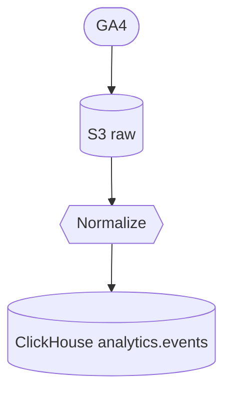

## Pipeline Registry

This registry defines a standard, portable file structure for data pipelines. A pipeline moves data from a source system into a destination system using the MooseStack. Pipelines are stored by pipeline name, then by version and organization/author, and contain shared metadata plus one or more language-specific implementations (e.g., Python and TypeScript) for transforms and orchestration helpers.

Pipelines created here can be transferred into a target codebase (similar to how shadcn components are copied) without coupling to any specific repository layout.

### Naming conventions

- **pipeline name**: kebab-case (e.g., `ga-to-clickhouse`, `shopify-orders-to-warehouse`)
- **author/organization**: kebab-case GitHub org or user (e.g., `514-labs`). Must correspond to a real GitHub handle (used for linking and avatars)
- **python package name**: snake_case (e.g., `pipeline_ga_to_clickhouse`)
- **typescript npm package**: prefer `@workspace/` prefix inside this monorepo (e.g., `@workspace/pipeline-ga-to-clickhouse`)
- Do not commit secrets. Use `.env.example` for documented variables; never override real `.env` in this repo.

## Directory layout

Each pipeline follows the same top-level structure:

```
{pipeline}/
  _meta/                  # pipeline-level shared metadata and assets only (no docs)
  {version}/
    _meta/                # version-level metadata and assets only (no docs)
    {author}/
      _meta/              # provider-specific metadata (pipeline.json) and assets only (no docs)
      python/             # Python implementation (optional)
      typescript/         # TypeScript implementation (optional)
```

Notes:

- `_meta` folders are metadata-and-assets only. All documentation (getting started, configuration, outputs) must live in the language-specific implementations (e.g., `typescript/docs/*`).

### Pipeline metadata

Pipeline metadata is captured in JSON. There is a root-level descriptor and a provider-level descriptor:

- Root: `{pipeline}/_meta/pipeline.json`
- Provider/version scoped: `{pipeline}/{version}/{author}/_meta/pipeline.json`

The provider-level `pipeline.json` includes the full runnable definition: source, systems, transformations, destination, schedule, and lineage hints.

Root descriptor fields:

- `identifier` (kebab-case ID, matches folder name)
- `name` (display name)

Example provider-level `pipeline.json`:

```json
{
  "$schema": "https://schemas.connector-factory.dev/pipeline.schema.json",
  "name": "ga-to-clickhouse",
  "author": "514-labs",
  "authorType": "organization",
  "version": "v4",
  "description": "Ingest GA4 events and load into ClickHouse",
  "tags": ["ga4", "clickhouse", "etl"],
  "schedule": { "cron": "0 * * * *", "timezone": "UTC" },
  "source": {
    "type": "connector",
    "connector": { "name": "google-analytics", "version": "v4", "author": "514-labs" },
    "stream": "events"
  },
  "systems": [
    { "id": "s3_raw", "type": "s3", "bucket": "my-bucket", "path": "ga/events/raw/" }
  ],
  "transformations": [
    { "id": "normalize_events", "type": "typescript", "inputs": ["s3_raw"], "outputs": ["ch_stage.events"] }
  ],
  "destination": { "system": "clickhouse", "database": "analytics", "table": "events" },
  "lineage": {
    "nodes": [
      { "id": "source", "kind": "source", "label": "GA4" },
      { "id": "s3_raw", "kind": "system", "label": "S3 raw" },
      { "id": "normalize_events", "kind": "transform", "label": "Normalize" },
      { "id": "dest", "kind": "destination", "label": "CH analytics.events" }
    ],
    "edges": [
      { "from": "source", "to": "s3_raw", "label": "extract" },
      { "from": "s3_raw", "to": "normalize_events" },
      { "from": "normalize_events", "to": "dest", "label": "load" }
    ]
  },
  "maintainers": []
}
```

## Lineage diagram generation

Every pipeline should include a clear lineage diagram that shows the source, intermediate systems/transformations, and destination. The TypeScript scaffold includes a script that reads provider-level `pipeline.json` and emits a Mermaid flowchart to the provider `_meta/assets` folder. You can then convert it to SVG with Mermaid CLI.

Example Mermaid (simplified):



Generation (from a TypeScript implementation):

```
pnpm -C {pipeline}/{version}/{author}/typescript/{implementation} run lineage
pnpm -C {pipeline}/{version}/{author}/typescript/{implementation} run lineage:svg
```

This will write `lineage.mmd` and `lineage.svg` under `{pipeline}/{version}/{author}/_meta/assets/`.

## Scaffolds

The `_scaffold/` directory contains JSON files that describe how to generate pipeline folders/files.

- `meta.json`: root, version, and provider `_meta` scaffolds (assets only; no docs). Creates `pipeline.json` descriptors
- `python.json`: Python implementation scaffold focused on pipeline transforms/utilities
- `typescript.json`: TypeScript implementation scaffold (includes docs and lineage generation scripts)

Each scaffold uses variables:

- `{pipeline}`: pipeline name (kebab-case)
- `{version}`: pipeline version identifier (e.g., `v1`, `2024-10-01`)
- `{author}`: organization/author (kebab-case GitHub handle)
- `{packageName}`: language-specific package name
  - Python: snake_case (e.g., `pipeline_ga_to_clickhouse`)
  - TypeScript: npm package (e.g., `@workspace/pipeline-ga-to-clickhouse`)

A generator can interpret the `structure` array and create files/directories with optional `template` contents, replacing placeholders with the provided variables.

## Adding a new pipeline

1. Choose pipeline, version, and author names (kebab-case). The author must be a GitHub organization or user handle.
2. Generate root `_meta/` with `pipeline.json` and `assets/` using `_scaffold/meta.json`.
3. Generate version-level `_meta/` for the selected `{version}`.
4. Generate provider-level `_meta/` with the runnable `pipeline.json`.
5. Add language-specific implementations using `_scaffold/python.json` and/or `_scaffold/typescript.json`.
6. Put documentation into the language-specific implementations (not `_meta`).
7. Optionally define output schemas in each implementation under `schemas/`.
8. Generate lineage into `{version}/{author}/_meta/assets/`.

> Note: Always use pnpm in this monorepo. For TypeScript, ensure Node 20. Do not commit real `.env` files.
