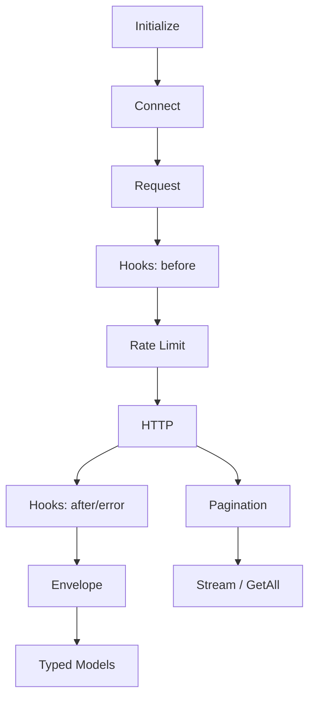

export const metadata = {
  title: "HubSpot Connector Spec (v2) – Strongly‑Typed, Production‑Ready",
  description: "Concise specification describing what was implemented for the HubSpot connector, why, and how it maps to the API Connector baseline spec"
}

## HubSpot Connector Spec (v2)

This v2 spec documents the concrete implementation decisions for the HubSpot CRM connector, aligned with the baseline API Connector Specification and refined from the MVP‑focused spec‑1.

The goals of v2 were: strong types end‑to‑end, predictable pagination, resilient requests (retries + rate limits), and an extensible surface via hooks – all while keeping domain code thin and reusable.

### Scope and Design Principles

- **Type‑safe by default**: Domain models and responses are fully typed for IntelliSense and safety.
- **Thin domains, reusable primitives**: CRUD behavior and pagination live in shared utilities; domains only bind paths and types.
- **Operationally robust**: Token‑bucket rate‑limiting, bounded retries with backoff + jitter, and a consistent response envelope.
- **Extensible**: Hooks at key points; response shaping/transforms live outside domain logic.

## What We Implemented

### Lifecycle

- `initialize(config)`: Validates and derives defaults (base URL, retry and rate‑limit defaults, headers).
- `connect()` / `disconnect()`: Toggle readiness and clean up resources.
- `isConnected()`: Lightweight readiness flag.

Why: mirrors the baseline spec; enables predictable setup and controlled teardown for batch/sync workflows.

### Request Pipeline

- Single `request({...})` primitive used by all domain helpers.
- Pipeline order: defaults → auth → hooks(before) → rate‑limit(waitForSlot) → HTTP → hooks(after|error) → envelope.
- Per‑request timeout enforced at transport layer.

Why: centralized concerns (auth, rate‑limit, retries, hooks) minimize domain complexity and enable consistent behavior.

### Response Envelope

All calls return a stable envelope with:
- `data`: parsed response
- `status`: HTTP status code
- `headers`: normalized headers
- `meta`: `{ timestamp, durationMs, retryCount, requestId?, rateLimit? }`

Why: observability and downstream ergonomics; mirrors the baseline spec structure.

### Strongly‑Typed Models (New in v2)

We introduced modular, domain‑specific models under `src/models/` with shared bases:

- Shared: `HubSpotObject`, list/single response shapes, and common param types.
- Domains: `contacts`, `companies`, `deals`, `tickets`, `engagements` each define `{Domain}Properties`, `{Domain}`, and API contracts (`{Domain}sResponse`, `{Domain}Response`).

Why: provides IntelliSense in consumers and tests; reduces casting and runtime mistakes.

### Domains via Reusable CRUD

- Generic `makeCrudDomain<TObject, TList, TSingle>(path, send)` implements `list`, `get`, `streamAll`, `getAll`.
- Each domain binds types + path (e.g., `/crm/v3/objects/contacts`).

Why: eliminates duplication, ensures consistent semantics across objects, and concentrates pagination/collection logic.

### Pagination (HubSpot Cursor)

- Strategy: cursor pagination using `limit` and `after`; response uses `paging.next.after`.
- Provided surfaces:
  - `paginate<T>({ path, query, pageSize })` → async iterator of arrays
  - Domain helpers:
    - `stream{Domain}s({ properties?, pageSize? })` (yields items)
    - `get{Domain}s({ properties?, pageSize?, maxItems? })` (collects with cap)

Why: memory‑efficient streaming for large datasets and ergonomic bulk collection with explicit limits.

### Rate Limiting

- Token‑bucket limiter with `capacity = burstCapacity`, `refillPerSec = requestsPerSecond`, enforced before requests.

Why: protects from provider throttling and smooths bursts while preserving throughput.

### Retries

- Exponential backoff with jitter; honors `Retry‑After` when present.
- Retry budget (time‑boxed) and a bounded `maxAttempts` list.
- Retryable signals include: 408/425/429/5xx and transient network failures.

Why: practical resiliency aligned with the baseline; avoids hot loops and thundering herd.

### Hooks

- Supported types: `beforeRequest`, `afterResponse`, `onError`, `onRetry`.
- Hooks can modify request/response envelopes or short‑circuit via `abort`.

Why: enables cross‑cutting concerns (logging, transforms, mapping) without bloating domain logic.

## Configuration (What We Support)

- Base: `baseUrl` (default `https://api.hubapi.com`), `timeoutMs`, `userAgent`, `defaultHeaders`, `defaultQueryParams`.
- Auth: Private App Token `{ type: "bearer", bearer: { token } }`.
- Retry: `{ maxAttempts, initialDelayMs, maxDelayMs, backoffMultiplier, retryableStatusCodes, retryBudgetMs, respectRetryAfter }` (sensible defaults).
- Rate‑limit: `{ requestsPerSecond, burstCapacity, concurrentRequests }`.
- Hooks: `{ beforeRequest[], afterResponse[], onError[], onRetry[] }`.

Deferred to future (tracked): OAuth2, adaptive limits from headers, circuit breaker, input/output schema validation.

## Domain Surface (Typed)

Across contacts, companies, deals, tickets, and engagements:

- List: `list{Domain}s({ properties?, limit?, after? }) → Envelope<{Domain}sResponse>`
- Get: `get{Domain}({ id, properties? }) → Envelope<{Domain}Response>`
- Stream: `stream{Domain}s({ properties?, pageSize? }) → AsyncIterable<{Domain}>`
- Get All: `get{Domain}s({ properties?, pageSize?, maxItems? }) → {Domain}[]`

Engagements additionally require `objectType` in parameters (one of: `notes`, `calls`, `emails`, `meetings`, `tasks`).

Why: consistent consumer experience; full IntelliSense on `{Domain}Properties` and response shapes.

## Testing (What We Cover)

- Unit tests for pagination iterator and domain list/get contracts with HTTP mocking.
- Type‑level guarantees through the exported models used in tests/consumers.
- Live/integration tests are gated and optional.

Why: fast feedback for core behaviors; integration remains opt‑in.

## Practical Notes Learned

- Keep domain functions thin; prefer hooks for data shaping to avoid coupling.
- Avoid setting `Content‑Type` on GET by default; always send `Accept: application/json`.
- Prefer selective `properties` to reduce payloads and speed pagination.
- Rate limiter before transport avoids unnecessary 429s; retries back off respectfully.

## Conformance to Baseline Spec

- Lifecycle, request primitive, response envelope: implemented.
- Pagination (cursor), retries with jitter, rate limiting: implemented.
- Hooks at four stages: implemented.
- Strong typing for models and API contracts: implemented in v2.
- Deferred areas (OAuth2, adaptive limits, circuit breaker, validation): acknowledged and planned.

---

### Appendix – Visual Overview

